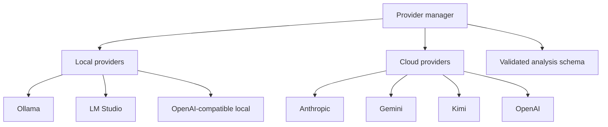

# Architecture

PhotoSage is a local-first Python application with a shared service layer used by
the CLI and desktop GUI. Filesystem changes are planned and journaled before they
are applied.

## Processing flow

```mermaid
flowchart LR
    A["CLI or GUI"] --> B["Configuration validation"]
    B --> C["Media scanner"]
    C --> D["Metadata extraction"]
    D --> E["Metadata quality score"]
    E -->|"Below threshold"| F["Provider manager"]
    E -->|"Enough metadata"| G["Filename builder"]
    F --> H["Local or cloud vision provider"]
    H --> G
    G --> I["Collision and review policy"]
    I --> J["Checksummed preview manifest"]
    J --> K["Manual review"]
    K --> L["Apply journal"]
    L --> M["Filesystem rename"]
    M --> N["Destination verification"]
    N --> O["Final manifest"]
    O --> P["Undo or recovery"]
```



No provider response directly renames a file. It becomes input to the naming and
review pipeline.

## Component boundaries

| Component | Responsibility |
| --- | --- |
| CLI | Parses commands, renders results, and selects service operations. |
| GUI | Provides desktop browsing, previews, review, and operations through the same backend services. |
| Configuration | Loads YAML, applies defaults, rejects unknown or unsafe values, and enforces local/cloud policy. |
| Scanner | Discovers supported files with recursion and type rules. |
| Metadata pipeline | Extracts technical metadata, OCR/document fields where enabled, GPS input, media attributes, and astronomy data. |
| Scoring | Decides whether available metadata is sufficient without AI. |
| Provider manager | Checks availability, performs bounded retries, applies ordered fallback, and respects `local_only`. |
| Providers | Convert media into provider-specific requests and validate structured analysis responses. |
| Naming | Builds sanitized filenames from templates and stable counters. |
| Review | Enforces confidence and duplicate gates and records decisions. |
| Manifest service | Writes atomic, checksummed transaction records. |
| Rename engine | Performs no-overwrite operations with before/after fingerprint checks. |
| Recovery and undo | Reconciles interrupted state or reverses verified completed operations. |
| Search | Stores local indexes and supports metadata/semantic queries. |
| Integrations | Launch PhotoSage workflows from Lightroom Classic, Capture One, and Apple Photos. |

## Provider architecture



The manager owns retry and fallback. Each provider owns authentication, request
format, response extraction, model-specific settings, and a readiness check.
Provider results must satisfy the common analysis schema before the pipeline uses
them.

## Trust boundaries

PhotoSage has four distinct data boundaries:

1. The local filesystem contains source media, private paths, manifests, logs,
   caches, thumbnails, and indexes.
2. Local AI endpoints receive image and metadata data but do not require Internet
   transfer. Non-loopback endpoints require explicit allowlisting.
3. Cloud providers receive the image and an allowlisted metadata subset only when
   `local_only` is false.
4. Catalog applications receive or launch path-based workflows according to their
   integration script.

Credentials are read from environment variables. They must not enter config
files, manifests, logs, generated packages, or exception output.

## Local artifacts

Default runtime artifacts include:

```text
manifests/
logs/
.photosage-cache/
  geocode_cache.json
  thumbnails/
  profiles/
  recent_manifests.json
  search.sqlite3
```

These paths are operational data, not source code. They can contain sensitive
filenames, locations, derived image content, or processing history. Keep them
ignored and back them up according to the photo collection's privacy policy.

## Mutation guarantees

The rename engine is designed around these invariants:

- Preview is the default.
- Existing destinations are never overwritten.
- The source fingerprint must match the approved preview.
- A journal checkpoint precedes each filesystem rename.
- The destination fingerprint is verified after rename.
- Failed verification attempts rollback and records the result.
- Duplicate findings and low-confidence AI suggestions remain reviewable.
- Undo and recovery use the original manifest rather than inference from names.

See [Recovery and Review](recovery-and-review.md) for state details.

## Dependency layers

Runtime dependencies support configuration, CLI presentation, image and metadata
handling, HTTP clients, media probing, optional providers, search, and the Qt GUI.
Development dependencies add tests, coverage, linting, type checking, packaging,
documentation checks, and SBOM tooling.

The locked dependency set is the reproducible source for CI and release builds.
A provider SDK or GUI dependency must remain optional at runtime when the related
feature is not selected.

## Extending the system

New functionality should enter through an existing service boundary. A new
provider must implement the common provider contract and be registered in config,
health reporting, CLI/GUI selection, tests, and documentation. A new filesystem
mutation must use a manifest and recovery design rather than a direct command-side
rename.

See [Contributing](../CONTRIBUTING.md) for the required quality gate.
